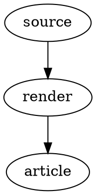
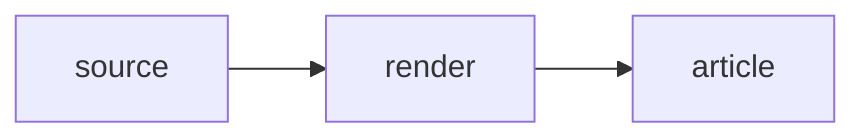

I can explain a publishing path in prose, but sometimes the reader needs to see the pieces at once. That is when I reach for a diagram. The trouble is that a diagram can be technically correct and still be miserable to read: too wide for the article, tiny labels on a phone, or dark lines that disappear against the site's background. Code has a similar problem. A few commands belong in the story, but a complete script can swallow several screens before the reader gets back to the point.

I wanted both to behave like editorial content. The figure should make sense in the article and open larger when someone needs its detail. A complete source file should be inspectable without forcing a download, with the download still available when the reader wants to run or adapt it. That sounds like presentation work, but it also changes how I prepare and review a technical post.

<!--more-->

## A Diagram Has More Than One File

Take the Part 5 figure that traced project data into the site. Its editable source is a Graphviz `.dot` file. I render an SVG for the article and keep a PNG companion. The source is where I fix an incorrect arrow or label. The SVG is the published figure readers see. The PNG is a separate retained image asset; it is not what the article's zoom link displays.

I use Mermaid for some figures and Graphviz for others. The choice matters less than keeping something I can edit and render again. Pasting a screenshot of a diagram into a post would make every later correction an image-editing job. Raw ASCII art has the opposite problem: it is editable, but alignment and line length do not hold up well across the screens where people actually read. The source and the rendered figure have different jobs, so I keep both.

Graphviz reads a `.dot` file. [DOT describes nodes, arrows, and layout attributes](https://graphviz.org/doc/info/lang.html); the `dot` command turns that text into an image. This article's first figure comes from a `.dot` file. [Mermaid](https://mermaid.js.org/intro/getting-started.html) reads a `.mmd` file whose text describes a flowchart, sequence, or another supported diagram; its command-line renderer is `mmdc`. The source-code figure later in this article comes from `.mmd`. Here is the smallest useful distinction between their syntax:





I do not use Homebrew. I build Graphviz from source; [Graphviz's source packages and build instructions](https://graphviz.org/download/source/) are the place to start if you want to do the same. The source-package route normally runs `./configure`, `make`, and `make install` after its dependencies are in place; the [upstream build guide](https://graphviz.org/doc/build.html) covers those dependencies and configure options. [Mermaid CLI's own instructions](https://github.com/mermaid-js/mermaid-cli) offer `npm install -g @mermaid-js/mermaid-cli` once Node.js and npm are available. You only need the resulting `dot` and `mmdc` executables on your path to use the render commands below. Check those first, then render a source file:

```bash
dot -V
mmdc --version

dot -Tsvg figure.dot -o figure.svg
dot -Tpng figure.dot -o figure.png
mmdc -i figure.mmd -o figure.svg -t dark -b transparent
mmdc -i figure.mmd -o figure.png -t dark -b transparent
```

[`pip install graphviz` installs a Python interface](https://graphviz.readthedocs.io/en/stable/manual.html), not the `dot` executable; it still requires Graphviz itself. There is no pip step in this site's diagram commands. [Graphviz documents its output flags](https://graphviz.org/doc/info/command.html), and the [Mermaid CLI guide](https://github.com/mermaid-js/mermaid-cli) shows its SVG, PNG, and Markdown conversion modes. Jekyll does not interpret either source file here. I render the image first, then give its SVG path to the article include. Mermaid SVGs can need one more normalization step: `mmdc` may write `width="100%"`, so I set explicit dimensions from the SVG `viewBox` before using the file in this site's full-size viewer.

I added a small Python command at `utils/bin/render-blog-diagram.py` so I do not have to remember both sets of flags every time. It calls the installed `dot` or `mmdc` executable based on the source extension, renders both formats, and handles that Mermaid SVG dimension fix. It has no extra Python package dependency. These are the two Part 6 figures, with the second argument naming the output path *without* `.svg` or `.png`:

```bash
python3 utils/bin/render-blog-diagram.py html/assets/code/jekyll-site-tooling/post-06/jekyll-post-06-diagram-path.dot html/assets/images/blog/jekyll-site-tooling/post-06-diagram-path
python3 utils/bin/render-blog-diagram.py html/assets/code/jekyll-site-tooling/post-06/jekyll-post-06-source-path.mmd html/assets/images/blog/jekyll-site-tooling/post-06-source-path
```

The script prepares both files before replacing the published pair, so a renderer failure does not overwrite the previous output. It is an explicit authoring command today; a normal Jekyll rebuild does not call it automatically.

Both editable source files live under the site's public `assets/code` directory, so the article can show the real input for each image. Here is the DOT file for the first figure:



The rendered SVG goes through the site's `blog_diagram.html` include. That gives it a shared figure wrapper, alternative text, an optional centered caption, and a link to the full-size viewer. The stylesheet constrains the inline image to the article width and caps its height according to whether I call it a compact or series figure. I do not have to paste the same figure markup and sizing rules into every post.



The colors are part of this job too. This site is dark. A diagram with a white rectangle behind it looks pasted on, while dark connectors can vanish completely. The current publication convention is a transparent or dark canvas with light labels and connectors, then colored shapes with enough contrast to carry the grouping. I check that in the article, because an image previewer on a white background can give me false confidence.

## One Figure Needs Two Reading Sizes

The inline diagram is there to keep the argument moving. It is not a promise that every label will be comfortable on a narrow phone. The figure itself and its “Open full-size diagram” link open a separate viewer page in a new tab. That page loads a same-origin SVG, fits it to the viewport, and offers zoom buttons and pointer panning. A reader can use Close or Escape to leave it. The viewer is a page, not a modal sitting over the article.

There is a useful constraint in the viewer code: the requested URL must be on this site's origin and have an `.svg` pathname. That keeps this particular reader flow pointed at site-hosted diagrams. It is not a sanitizer for arbitrary SVG files, and it does not make every submitted image safe. I still choose and review the asset that goes into the post.

I tested the current flow from the Part 5 Hands-On page: the disclosure opens in place, the diagram link opens the separate viewer, the SVG loads with its accessible description, and the zoom control responds. Escape closes the script-opened viewer tab in that browser. If someone opens the viewer directly and the browser refuses `window.close()`, the page has a navigation fallback. The distinction matters because “click to expand” sounds simpler than the browser behavior actually is.

## Give Complete Code Its Own Space

For a short command or a small excerpt, an ordinary fenced code block is enough. It sits next to the paragraph that explains why I am running it. A whole program is different. I want readers to skim the article first, open the complete file if they are interested, and then download it if they plan to try it.

The Part 5A lab has a `run_lab.py` file. Here it is through the same source disclosure used in that companion:



The `source_code.html` include starts collapsed. Opening it shows server-side Rouge highlighting and an explicit “Download run_lab.py” action. The highlighting filter reads the file from `assets/code` during the Jekyll build, while the download link names that same public file. I do not maintain one excerpt in Markdown and a slightly different script in a ZIP and hope I remembered to edit both. The disclosure is an inspection path; the archive and checksum in the Hands-On post are the runnable lab package.



The source-code figure above is the Mermaid example; its editable `.mmd` file produced the SVG shown here. The filter resolves the requested code file and the allowed `assets/code` directory to real paths before reading. If the resolved file is outside that directory, the build fails rather than quietly publishing some other local file. That is a useful boundary for this include, not a review of what the script does when somebody runs it. The lab still needs its own tests, dependency instructions, checksum, and plain warning about what it touches.

Here is that figure's Mermaid source. The page shows it through the same collapsed source viewer, and its download points to the file I render with `mmdc`:



## Review the Artifact, Not Just the Markdown

I have to inspect the rendered article, not merely check that Jekyll accepted the file. For a diagram, I compare the editable source with the SVG I am about to publish, look at the figure against the actual dark page, and open the viewer. On a narrow screen I check whether the preview stays within the article and whether the full-size route remains usable. A successful SVG render tells me nothing about a mislabeled arrow or a caption that claims more than the figure shows.

For code, I check that the disclosure opens, that the download points to the file I reviewed, and that the lab runs under the stated dependencies. The source viewer makes the file easier to inspect; it does not certify its behavior. That separation lets me keep the main article readable while still giving a technical reader enough material to verify the mechanism.

## A Build Step I Might Add

It would be handy to keep a diagram's `.dot` or `.mmd` text right in the post, let a rebuild render its SVG and PNG, and replace that source block with the same figure presentation readers already know. [Mermaid CLI can already convert Mermaid blocks in Markdown into linked images](https://github.com/mermaid-js/mermaid-cli). Doing that for both languages *inside this Jekyll site*, with our captions and viewer, would still need a deliberate build-time processor. It would have to identify only opted-in blocks, give each one a stable name and alt text, render the assets, and replace the block in the built page without rewriting my original Markdown.

I would compare a hash of each source block and its render settings with the recorded render, rather than use the Markdown file's modification time. A prose edit would otherwise redraw every figure, and a fresh Git checkout can change timestamps without changing the diagram. The render belongs before the Jekyll build; a pre-commit check could then report stale assets. That integration is still a proposal. For now the source lives in separate `.dot` and `.mmd` files, and I run the Python renderer explicitly.

## Current State

The DOT or Mermaid source, SVG, PNG, shared figure include, and separate viewer are distinct pieces of this site's publication workflow. Complete source files have a similarly deliberate path: one public file, a collapsed highlighted view, and an explicit download. Those conventions let me add detail without making every article a wall of code or a collection of oversized images.

The [Hands-On 6A companion]({{ page.series_companion_url | relative_url }}) starts with the two source files from this article. It renders them with installed tools, changes one label in each, and checks the new images without changing the site's published assets.

## Next Work

First, Hands-On 6A makes the source-to-image step visible. Then Part 7 turns to a different editing tool I came to rely on: listening to the article and hearing where the prose stops sounding like me.
